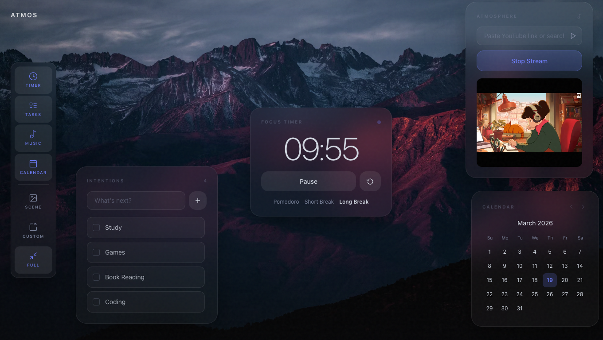

# 🌿 Atmos — Focus Space

---

A calm, premium productivity space designed for deep work.  
Atmos helps users stay focused using a distraction-free interface, ambient sound, and structured task flow.

---

## ⚠️ Current Status

> 🚧 This project is **currently optimized for desktop only**  
> Mobile and tablet responsiveness is part of the upcoming roadmap.

---
## 📸 Screenshots

---

## 🚀 Problem

Modern productivity tools are **overloaded and distracting**:

* Too many features → cognitive overload  
* Poor UI → breaks focus  
* No emotional design → feels like work, not flow  

Users need a **calm digital environment** that encourages deep work.

---

## 💡 Solution

Atmos is a **minimal, aesthetic focus space** that combines:

* ⏱ Focus timer (Pomodoro-style)  
* ✅ Task management  
* 🎧 Ambient sound experience  
* 🌙 Calm, premium UI  

Built to make productivity feel **effortless and enjoyable**.

---

## ✨ Features

* 🎯 Distraction-free interface  
* ⏳ Focus timer with session tracking  
* 📝 Simple task manager  
* 🎶 Ambient sound integration (Spotify / YouTube)  
* 🌌 Aesthetic UI with smooth animations  

---

## 🧠 Product Thinking

### Target Users

* Students preparing for exams  
* Developers / creators  
* Anyone practicing deep work  

### Key Goal

Increase **focus session completion rate** and reduce distractions.

### Future Roadmap

* 📊 Analytics dashboard (focus time tracking)  
* 👥 Social accountability (study rooms)  
* 📱 Mobile responsive + PWA  
* 🤖 Smart recommendations (AI-based focus patterns)  

---

## 🛠 Tech Stack

* HTML  
* CSS / Tailwind  
* JavaScript (Vanilla)  
* GSAP (animations)  

---

## 🌍 Live Demo
https://atmoslive.vercel.app
---

## 🤝 Contributing

Feel free to fork and improve the project.
